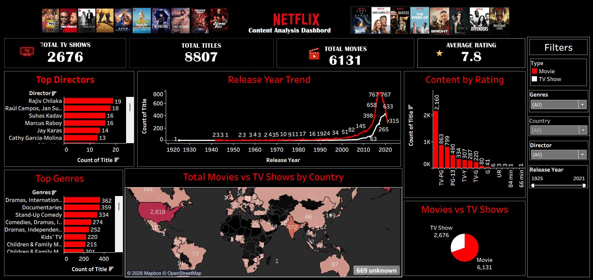

# 📊 Netflix Content Analysis Dashboard | Tableau

An interactive Netflix Content Analysis Dashboard created using Tableau to analyze Netflix movies and TV shows and identify important content trends and patterns.

## 🎯 Project Objective

The objective of this project was to transform raw Netflix data into an interactive and visually engaging Tableau dashboard.

## 🔎 Analysis Performed

* Analyzed 8,807 Netflix titles
* Compared 6,131 Movies and 2,676 TV Shows
* Analyzed ratings and release-year trends
* Identified top directors based on title count
* Analyzed common genres
* Studied country-wise content distribution
* Compared Movies and TV Shows across countries
* Added interactive filters for Type, Genre, Country, Director and Release Year

## 📊 Dashboard Features

* KPI Cards
* Trend Analysis
* Bar Charts
* Geographic Analysis
* Rating Distribution
* Movie vs. TV Show Comparison
* Interactive Filters
* Country-wise Analysis

## 🛠️ Tools & Skills

* Tableau
* Data Cleaning
* Data Analysis
* Data Visualization
* Dashboard Design
* Interactive Filters
* KPI Analysis
* Trend Analysis

## 💡 Key Learning

This project provided practical experience in transforming raw data into an interactive dashboard and helped strengthen my skills in data visualization, trend analysis, dashboard design and presenting insights clearly.

## 📸 Dashboard Preview

## 👩‍💻 Author

**Rohith Krishna K**

GitHub:https:https://github.com/rohithkrishna-k/Rohith-Krishna-K
LinkedIn:https://www.linkedin.com/in/rohith-krishna-k/
